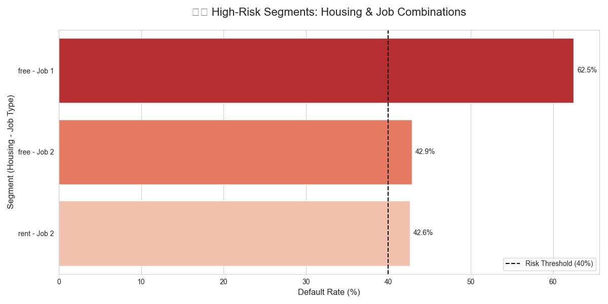
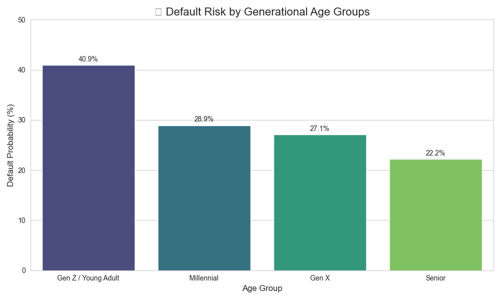

German Credit Risk Prediction
This project uses Machine Learning to predict whether a loan applicant is a "Good" or "Bad" credit risk. It includes a full data science pipeline: Exploratory Data Analysis (EDA), Feature Engineering, Multi-Model Comparison, and a live web application built with Streamlit.

Project Overview
The goal of this project is to minimize financial loss for banks by identifying high-risk applicants. We performed extensive "Risk Checks" to see how features like Age, Credit Amount, and Housing correlate with defaults.
Key Insights from EDA:
Monthly Burden: Applicants with a higher ratio of credit amount to loan duration (Monthly Installments) showed a significantly higher probability of being labeled "Bad Risk."

Skewness: Credit amounts were heavily right-skewed, requiring a Log Transformation to improve model performance.

Housing Stability: Applicants who "Own" their homes generally represent a lower risk profile compared to those in "Rent" or "Free" housing.

Performance ComparisonWe tested four different classifiers using GridSearchCV to find the optimal hyperparameters.ModelAccuracyExtra Trees Classifier72.50%XGBoost71.50%Random Forest70.00%Decision Tree67.00%

# 🏦 Credit Risk AI Analysis & Prediction

[Brief project description here]

## 📊 Strategic Business Insights
Our SQL-driven analysis revealed three critical risk vectors:

1. **High-Risk Segments**: Applicants who are 'Renters' and 'Skilled Workers' show a default rate exceeding 40%.
2. **Generational Risk**: Younger applicants (Gen Z) carry a significantly higher risk density than Seniors.
3. **Liquidity Mapping**: There is a clear correlation between low checking account balances and high-value loan defaults.

## ⚙️ Feature Engineering
[Explain your Log Transform and Monthly Installment features here]

## 🚀 How to Run the App
1. Install requirements: `pip install -r requirements.txt`
2. Run Streamlit: `streamlit run app.py`